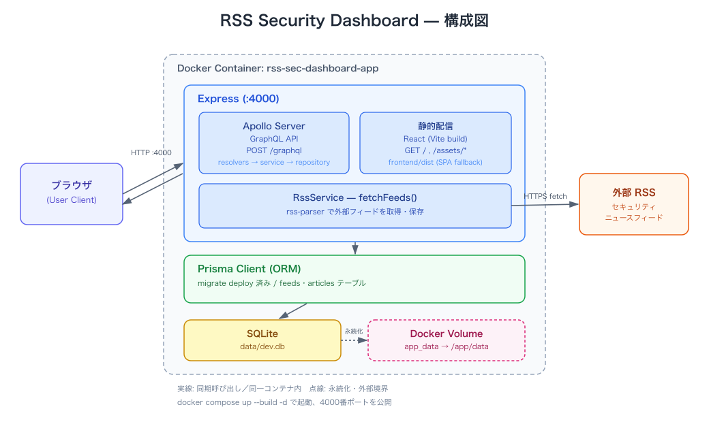

# RSS Security Dashboard

情報セキュリティに関する RSS を取得し、GraphQL で管理・閲覧できるダッシュボードの骨組みです。
本番運用を見据えた Clean Architecture + 明示的な DI により、機能を継ぎ足ししやすい構成になっています。

## 構成図



## 技術スタック

| 領域 | 採用技術 |
|---|---|
| バックエンド | Go 1.25 |
| GraphQL サーバー | `github.com/graph-gophers/graphql-go` |
| ORM | GORM + SQLite（開発時）、PostgreSQL（`DATABASE_URL` で切り替え） |
| 認証 | bcrypt + JWT（`golang-jwt/jwt/v5`） |
| RSS 取得 | `gofeed` |
| フロントエンド | React 18 + Vite + Apollo Client |
| ログ | `log/slog`（`LOG_FILE` 設定でファイル出力） |
| ログ収集 | Filebeat + Kafka（`docker-compose.logging.yml`） |
| テスト | Go testing + testify + Playwright E2E |

## ディレクトリ構成

```
qr/
├── backend/
│   ├── cmd/server/          # DI コンテナ・サーバー起動
│   ├── internal/
│   │   ├── config/          # 環境変数
│   │   ├── domain/          # ドメインモデル・エラー
│   │   ├── usecase/         # ユースケース + リポジトリポート（interface）
│   │   ├── repository/      # GORM + SQLite アダプタ
│   │   ├── security/        # パスワードハッシュ・JWT
│   │   ├── rss/             # RSS パーサー
│   │   └── delivery/        # GraphQL / HTTP 配信層
│   ├── go.mod
│   └── .env.example
├── frontend/                # React + Vite + Apollo Client
├── docker-compose.yml
├── docker-compose.logging.yml
├── Dockerfile
└── .github/workflows/ci.yml
```

## セットアップ

```bash
# フロントエンドのビルド
npm install
npm run build

# バックエンドの起動
cd backend
cp .env.example .env   # 必要に応じて編集
export PATH=$PATH:$HOME/.local/go/bin
go run ./cmd/server
```

`http://localhost:4000` で UI と GraphQL API の両方が利用できます。
UI はレスポンシブ対応しており、iOS / Android のブラウザでも同じ URL で確認できます。

## 主なコマンド

### バックエンド

| コマンド | 説明 |
|---|---|
| `go run ./cmd/server` | 開発サーバー起動（port 4000） |
| `go build ./...` | 全パッケージのビルド |
| `go test ./...` | ユニットテスト実行 |
| `go vet ./...` | 静的解析 |

### フロントエンド

| コマンド | 説明 |
|---|---|
| `npm run dev` | Vite 開発サーバー起動 |
| `npm run build` | TypeScript コンパイル + 本番ビルド |
| `npm run test:e2e` | Playwright で E2E テスト実行 |

## GraphQL 例

```graphql
query {
  feeds {
    id
    name
    url
    category
    enabled
    articles {
      id
      title
      snippet
      publishedAt
      isRead
      isStarred
    }
  }
}

mutation {
  createFeed(input: {
    name: "Example Feed",
    url: "https://example.com/feed.xml",
    category: "News"
  }) {
    id
    name
  }
}

mutation {
  fetchFeeds {
    feedName
    inserted
    updated
    error
  }
}

mutation {
  markArticleRead(id: "<article-id>", isRead: true) {
    id
    isRead
  }
}

query {
  stats {
    feedCount
    articleCount
    readCount
    unreadCount
    starredCount
  }
}
```

## フロントエンド UI

`frontend/` に React + Vite + Apollo Client の管理画面があります。

```bash
# バックエンドを起動
cd backend
cp .env.example .env
go run ./cmd/server

# 別ターミナルでフロントエンドを起動
cd frontend
npm install
npm run dev
```

## CI / GitHub Actions

`.github/workflows/ci.yml` で以下を実行します。

- バックエンド: `go build / go vet / go test`
- フロントエンド: `npm audit` / `npm run build`
- E2E: Playwright でデスクトップ Chrome とモバイル Chrome（Pixel 5）を対象に E2E テスト

## Docker

```bash
# イメージをビルドして実行（SQLite 版。コンテナ内に DB ファイルを作成）
docker build -t rss-sec-dashboard .
docker run -p 4000:4000 -e JWT_SECRET=<secret> rss-sec-dashboard

# または docker compose で起動
JWT_SECRET=<secret> docker compose up --build -d
```

`docker compose` では `DATABASE_URL=file:/app/backend/data/dev.db` が使われ、GORM の `AutoMigrate` でテーブルが作成されます。永続化したい場合は `app_data` ボリュームを使ってください。

## ログ収集（Filebeat + Kafka）

`docker-compose.logging.yml` で Filebeat + ZooKeeper + Kafka を起動し、アプリログを Kafka トピック `rss-logs` に流せます。

```bash
# app + logging スタックを一括起動
JWT_SECRET=<secret> docker compose \
  -f docker-compose.yml \
  -f docker-compose.logging.yml \
  up --build -d

# Kafka トピックからログを確認
docker exec rss-sec-dashboard-kafka \
  kafka-console-consumer \
  --bootstrap-server localhost:9092 \
  --topic rss-logs \
  --from-beginning \
  --max-messages 10
```

- バックエンドは `LOG_FILE` が設定されている場合、標準出力に加えてファイルにもログを出力します（Docker では `/app/backend/logs/app.log`）。
- `filebeat/filebeat.yml` で `/var/log/app/*.log` を読み取り、NDJSON をパースして Kafka へ送信します。
- ローカル開発時は `LOG_FILE` を未設定にすれば、引き続き標準出力のみにログが出ます。

## 設計のポイント

- **Clean Architecture**: `internal/domain` → `internal/usecase` → `internal/repository` / `internal/delivery` の依存方向を守っています。
- **明示的 DI**: `cmd/server/main.go` で config、DB、リポジトリ、ハッシュ/JWT、ユースケース、HTTP サーバーを手動で構築します。依存グラフが PR 上で読み取れます。
- **リポジトリポート**: `usecase/ports.go` がリポジトリの interface（port）を定義しており、`repository` パッケージがそれを実装します。
- **RSS 取得**: `gofeed` でフィードを取得し、記事本文ではなくタイトル・リンク・スニペットのみを保存します（著作権対応）。
- **更新保護**: 既存記事の再取得時に `isRead` / `isStarred` のフラグは失われません。

## セキュリティ・ISO 27017 対応

本番運用を想定し、以下の技術的管理策を実装しています。

- **認証・認可**: JWT + bcrypt、役割ベースアクセス制御（`ADMIN` / `USER`）
- **パスワードポリシー**: 8 文字以上、大文字・小文字・数字を必須
- **アカウントロックアウト**: 連続ログイン失敗で一時ロック（回数・期間は env で設定）
- **監査ログ**: 認証イベントを `AuditLog` に記録、admin 専用 `auditLogs` クエリで閲覧
- **データのエクスポート・削除**: ユーザーは自分のデータを `exportMyData` で取得、`deleteMyAccount` で削除
- **通信・ヘッダー**: CSP、HSTS、X-Frame-Options 等のセキュリティヘッダー
- **脆弱性管理**: GitHub Actions で `npm audit` を実行
- **脆弱性開示**: `/.well-known/security.txt` を提供

ISO 27017 はクラウドサービスに関する運用面・契約面の管理策も含みます。上記はコードレベルで実装できる制御の例です。完全なコンプライアンスには、クラウドプロバイダとの共有責任モデル、インシデント対応、鍵管理、データ所在地等の文書化・運用プロセスが必要です。

## 今後の拡張例

- 多要素認証（TOTP）
- 定期 RSS 取得（GitHub Actions / cron）
- 通知・アラート機能
- フィード・記事のタグ付けと全文検索
